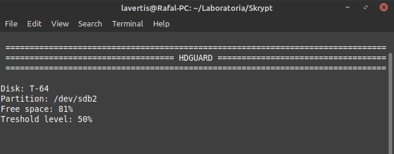
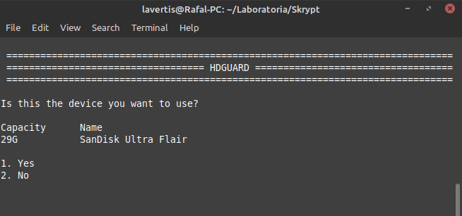
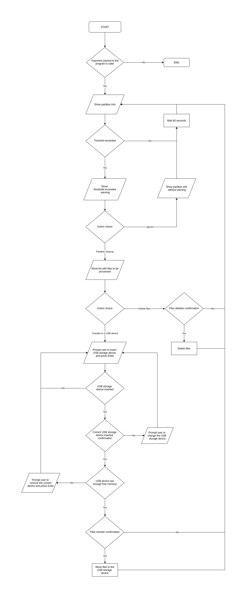

# HDGuard
This is an assingment for my Linux laboratories.
It is a bash script which is monitoring free space on the disk and shows a warning when the set treshold is exceeded.
You can choose to remove or move to a USB storage recently modified/created files in order to get below the threshold again.
There is an algorithm below ↓

